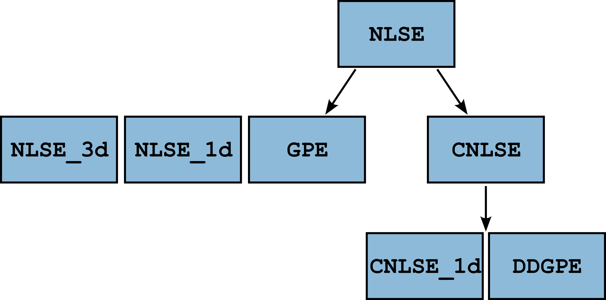

# NLSE

A small utility to easily simulate all sorts of non linear Schrödinger equations. It uses a [split-step spectral scheme](https://en.wikipedia.org/wiki/Split-step_method) to solve the equations.

## Installation

First clone the repository:

```bash
git clone https://github.com/Quantum-Optics-LKB/NLSE.git
cd NLSE
```

Then pip install the package:

```bash
pip install .
```

## Basic usage

After installing `NLSE`, you can simply import one of the solvers and instantiate your problem as follows:

```python
N = 2048 # number of points in solver
n2 = -1.6e-9 # nonlinear index in m^2/W
waist = 2.23e-3 # initial beam waist in m
waist2 = 70e-6 # potential beam waist in m
window = 4*waist # total computational window size in m
power = 1.05 # input optical power in W
Isat = 10e4  # saturation intensity in W/m^2
L = 10e-3 # Length of the medium in m
alpha = 20 # linear losses coefficient in m^-1

simu = NLSE(
    alpha, power, window, n2, None, L, NX=N, NY=N, Isat=Isat, backend=backend
)
# Define input field and potential
E_0 = np.exp(-(simu.XX**2 + simu.YY**2) / waist**2)
V = -1e-4 * np.exp(-(simu.XX**2 + simu.YY**2) / waist2**2)
simu.out_field(E_0, L, verbose=True, plot=True, precision="single")
```

<!-- TODO ADD IMAGE !!! -->

## Requirements

### Supported platforms

This code has been tested on the three main platforms: Linux, MacOs and Windows. The requirements are in the [`requirements.txt`](requirements.txt) at the root of the repo.

### GPU computing

For optimal speed, this code uses your GPU (graphics card). For this, you need specific libraries. For Nvidia cards, you need a [CUDA](https://developer.nvidia.com/cuda-toolkit) install. For AMD cards, you need a [ROCm](https://rocmdocs.amd.com/en/latest/) install. Of course, you need to update your graphics driver to take full advantage of these. In any case we use [CuPy](cupy.dev) for the Python interface to these libraries.

**The `cupy` dependency is not included in `setup.py` in order to not break installation on platforms that do not support it !**

### PyFFTW

If the code does not find Cupy, it will fall back to a CPU based implementation that uses the CPU : [PyFFTW](https://pyfftw.readthedocs.io/en/latest/). To make the best out of your computer, this library is multithreaded. By default it will use all available threads. If this is not what you want, you can disable this by setting the variable `pyfftw.config.NUM_THREADS` to a number of your choosing.

On Mac, you first need to install FFTW which can be done by simply using Homebrew `brew install fftw`. Some users reported this didn't work for them, in this case the next best bet is to build it from source following these instructions: [FFTW - Installation and customization](http://www.fftw.org/fftw2_doc/fftw_6.html).

**WARNING** : The default flag passed to `FFTW` for planning is `FFTW_PATIENT` which means that the first run of the code can take a long time. This information is cached so subsequent runs just have to load the plans, removing this computation time.

<!-- TODO Tuto to install FFTW on Mac ... -->

### PyVkFFT

We found out that [PyVkFFT](https://github.com/vincefn/pyvkfft/tree/master) was outperforming CuFFT so the GPU implementation uses this library for optimal performance.

Other than this, the code relies on these libraries :

- `numba` : for best CPU performance on Intel CPU's, with `icc_rt`
- `pickle`
- `numpy`
- `scipy`
- `matplotlib`

## Tests

Tests are included to check functionalities and benchmark performance.
You can run all tests by executing `tests/run_all_tests.py` (warning: this might take some time !).
It will test both CPU and GPU backends.

The benchmarks can be run using `tests/benchmarks.py` and compare a "naive" numpy implementation of the main solver loop to our solver.
On a Nvidia RTX4090 GPU and Ryzen 7950X CPU, we test our solver to the following results:


## How does it work ?

### Physical situation

The code offers to solve a typical [non linear Schrödinger](https://en.wikipedia.org/wiki/Nonlinear_Schr%C3%B6dinger_equation) / [Gross-Pitaevskii](https://en.wikipedia.org/wiki/Gross%E2%80%93Pitaevskii_equation) equation of the type :
$$i\partial_{t}\psi = -\frac{1}{2}\nabla^2\psi+V\psi+g|\psi|^2\psi$$

In this particular instance, we solve in the formalism of the propagation of a pulse of light in a non linear medium.
Within the [paraxial approximation](https://en.wikipedia.org/wiki/Paraxial_approximation), the propagation equation for the field $E$ in V/m solved is:

$$
i\partial_{z}E = -\frac{1}{2k_0}\nabla_{\perp}^2 E +
\frac{D_0}{2}\partial^2_t E
-\frac{k_0}{2}\delta n(r) E - n_2 \frac{k_0}{2n}c\epsilon_0|E|^2E
$$

Here, the constants are defined as followed :

- $k_0$ : is the electric field [wavenumber](https://en.wikipedia.org/wiki/Wavenumber) in $m^{-1}$
- $D_0$ : is the [group velocity dispersion](https://en.wikipedia.org/wiki/Group-velocity_dispersion) (GVD) in $s^2/m$
- $\delta n(\mathbf{r})$ : the "potential" i.e a local change in linear index of refraction. Dimensionless.
- $n_2$ : the [non linear index of refraction](https://en.wikipedia.org/wiki/Kerr_effect) in $m^2/W$.
- $n$ is the linear [index of refraction](https://en.wikipedia.org/wiki/Refractive_index). In our case 1.
- $c,\epsilon_0$ : the speed of light and electric permittivity of vacuum.

In all generality, the interaction term can be *non-local* i.e $n_2=n_2(\mathbf{r})$.
This means usually that the response will be described as a convolution by some non-local kernel:

$$
n_2(\mathbf{r})|E|^2(\mathbf{r})=n_2\int_{\mathbb{R}^2}\mathrm{d}\mathbf{r}' K(\mathbf{r}-\mathbf{r}')|E|^2(\mathbf{r}'),
$$

where $K(\mathbf{r})$ is the non-local kernel, typically the Green function of some diffusion equation.

Please note that all of the code works with the **"God given" units** i.e **SI units** !

### The `NLSE` class

The `NLSE` class aims at providing a minimal yet functional toolbox to solve non-linear Schrödinger type equation in optics / atomic physics settings such as the propagation of light in a Kerr medium or solving the Gross Pitaevskii equation for the evolution of cold gases.

The propagation equation is:

$$
i\partial_{z}E = -\frac{1}{2k_0}\nabla_{\perp}^2 E +
-\frac{k_0}{2}\delta n(r) E - n_2 \frac{k_0}{2n}c\epsilon_0|E|^2E
$$


#### Initialization

The physical parameters listed above are defined at the instantiation of the `NLSE` class (`__init__` function).
The backend (GPU or CPU) is tested when the library is imported, but you can then dynamically switch it when instantiating a `NLSE` class by setting the `self.backend` attribute to `"GPU"` or `"CPU"`.

#### Broadcasting

Since `numpy` / `cupy` allow for natural broadcasting of arrays of compatible size, one can leverage this in order to run parallel realizations. For instance, if we wish to propagate various initial state with the same physical parameters,
we simply have to initialize a *tensor* of fields of dimensions `(N_real, Ny, Nx)` where `N_real` is the number of initial states we wish to propagate.

Similarly, one can broadcast over the physical parameters by setting some parameters to be tensors as well. If we wish for instance to study the effect of the variation of $n_2$, one can set the `n2` attribute to be a `(N_real, 1, 1)` tensor.
The field should then be initialized to a `(N_real, Ny, Nx)` tensor of identical fields and each slice over the first dimension will represent the same field propagated with different parameters.
Finally, one can combine broadcasting over several parameters at the same time: if we wish to do a grid search over $n_2$ and $\alpha$, one can instantiate `n2` to be a `(N_n2, 1, 1, 1)` array, `alpha` to be a `(1, N_alpha, 1, 1)` and the field
a `(N_n2, N_alpha, Ny, Nx)` array.

The take-home message is that the array shape should be compliant with `numpy` [broadcasting rules](https://numpy.org/doc/stable/user/basics.broadcasting.html).

**WARNING : For now it is only available on the GPU backend !**

#### Numerical precision

In order to reach the best performance, the numerical precision is hardcoded as a constant variable at the top of `nlse.py`.
When importing the solvers like `NLSE`, the data types of the input arrays must match the data type given as input of `out_field`.

#### Callbacks

The `out_field` functions support callbacks with the following signature `callback(self, A, z, i)` where `self` is the class instance, `A` is the field, `z` is the current position and `i` the main loop index.
For example if you want to print the number of steps every 100 steps, this is the callback you could write :

```python
def callback(nlse, A, z, i):
    n = int(z/nlse.delta_z)
    if n % 100 == 0:
        print(n)
```

Notice that since the class instance is passed to the callback, you have access to all of the classes attributes.
Be mindful however that since the callback is running in the main solver loop, this function should not be called too often in order to not slow down the execution too much.

#### Propagation

The `out_field` method is the main function of the code that propagates the field for an arbitrary distance from an initial state `E_in` from z=0 (assumed to be the begining of the non linear medium) up to a specified distance z. This function simply works by iterating the spectral solver scheme i.e :

- (If precision is `'double'` apply real space terms)
- Fourier transforming the field
- Applying the laplacian operator (multiplication by a constant matrix)
- Inverse Fourier transforming the field
- Applying all real space terms (potential, losses and interactions)

The `precision` argument allows to switch between applicating the nonlinear terms in a single multiplication (`"single"`), or applying a "half" nonlinear term before and after computing the effect of losses, potential and interactions (`"double"`). The numerical error is $\mathcal{O}(\delta z)$ in the first case and $\mathcal{O}(\delta z^3)$ in the second case at the expense of two additional FFT's and another matrix multiplication (essentially doubling the runtime).\
The propagation step $\delta z$ is chosen to be the minimum between `1e-5` the Rayleigh length of the beam or `2.5e-2` $z_{NL}=\frac{1}{k_0 n_2 I}$, but this can be hand tuned to reach desired speed or precision by setting the `delta_z` attribute.

### Inheritance 

In order to minimize duplication, all classes inherit from the main `NLSE` class according to the following graph:

### The `NLSE_1d` class

`NLSE_1d` is a 1D specialization of `NLSE` for performance. 
It supports all of the features of the main `NLSE` class.

The propagation equation is:

$$
i\partial_{z}E = -\frac{1}{2k_0}\partial^2_x E +
-\frac{k_0}{2}\delta n(r) E - n_2 \frac{k_0}{2n}c\epsilon_0|E|^2E
$$

### The `NLSE_3d` class

`NLSE_3d` solves the full paraxial propagation equation.

**WARNING:** Since this solves a 3D+1 equation, this is computationally very intensive ! The space complexity scales as $N^3$ if $N$ is the field array size.

The propagation equation is:

$$
i\partial_{z}E = -\frac{1}{2k_0}\nabla_{\perp}^2 E +
\frac{D_0}{2}\partial^2_t E
-\frac{k_0}{2}\delta n(r) E - n_2 \frac{k_0}{2n}c\epsilon_0|E|^2E
$$

### The `CNLSE` class

The `CNLSE` class is a coupled non-linear Schrödinger equation allowing to solve the following equation:

$$
\begin{split}
i\frac{\partial\psi_f}{\partial z} &= -\frac{1}{2k_f}\nabla^2\psi_f -\frac{1}{2}n_2^f k_f c\epsilon_0|\psi_f|^2\psi_f + k_f n_2^{fd}c\epsilon_0|\psi_d|^2\psi_f-\frac{i\alpha_f}{2}\psi_f + \frac{\Omega}{2} \psi_d  \\
i\frac{\partial\psi_d}{\partial z} &= -\frac{1}{2k_d}\nabla^2\psi_d -\frac{1}{2}n_2^d k_d c\epsilon_0|\psi_d|^2\psi_d + k_d n_2^{fd}c\epsilon_0|\psi_f|^2\psi_d-\frac{i\alpha_d}{2}\psi_d + \frac{\Omega}{2} \psi_f
\end{split}
$$

This allows to describe the back reaction of the fluid onto the defect as well as two components scenarii.
In order to "turn on" different terms, it suffices to set the parameters value to something other than `None`.
When `None`, the solver does not apply the corresponding evolution term for optimal performance.

### The `CNLSE_1d` class

Similarly to `NLSE_1d`, the `CNLSE_1d` is a 1D specialization of `CNLSE` class.

The propagation equation is:

$$
\begin{split}
i\frac{\partial\psi_f}{\partial z} &= -\frac{1}{2k_f}\partial^2_x\psi_f -\frac{1}{2}n_2^f k_f c\epsilon_0|\psi_f|^2\psi_f + k_f n_2^{fd}c\epsilon_0|\psi_d|^2\psi_f-\frac{i\alpha_f}{2}\psi_f + \frac{\Omega}{2} \psi_d  \\
i\frac{\partial\psi_d}{\partial z} &= -\frac{1}{2k_d}\partial^2_x\psi_d -\frac{1}{2}n_2^d k_d c\epsilon_0|\psi_d|^2\psi_d + k_d n_2^{fd}c\epsilon_0|\psi_f|^2\psi_d-\frac{i\alpha_d}{2}\psi_d + \frac{\Omega}{2} \psi_f
\end{split}
$$

### The `GPE` class

The `GPE` class allows to solve the 2D Gross-Pitaevskii equation describing the temporal evolution of a Bosonic field:

$$
i\partial_{t}\psi = -\frac{1}{2}\nabla^2\psi+V\psi+g|\psi|^2\psi.
$$

It follows exactly the same conventions as the other classes a part from the fact that since it describes atoms, the units are the "atomic" units (masses in kg, times in s).


## Contributing and issues

If you wish to contribute, do not hesitate to create a PR or email me (tangui.aladjidi[at]lkb.upmc.fr).
If you encounter problems with this software, you can create an issue directly on this repository.
