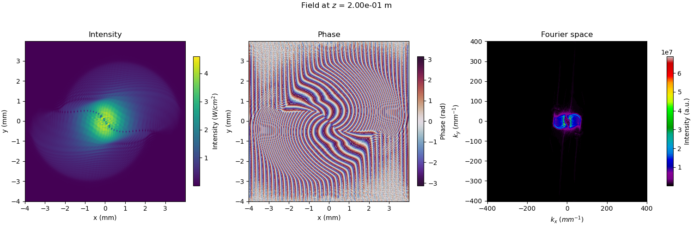

# NLSE

A small utility to easily simulate all sorts of non linear Schrödinger equation. It uses a [split-step spectral scheme](https://en.wikipedia.org/wiki/Split-step_method) to solve the equation.

## Requirements

### GPU computing

For optimal speed, this code uses your GPU (graphics card). For this, you need specific libraries. For Nvidia cards, you need a [CUDA](https://developer.nvidia.com/cuda-toolkit) install. For AMD cards, you need a [ROCm](https://rocmdocs.amd.com/en/latest/) install. Of course, you need to update your graphics driver to take full advantage of these. In any case we use [CuPy](cupy.dev) for the Python interface to these libraries.

### PyFFTW

If the code does not find Cupy, it will fall back to a CPU based implementation that uses the CPU : [PyFFTW](https://pyfftw.readthedocs.io/en/latest/). To make the best out of your computer, this library is multithreaded. By default it will use all available threads. If this is not what you want, you can disable this by setting the variable `pyfftw.config.NUM_THREADS` to a number of your choosing.

Other than this, the code relies on these libraries :
- `numba` : for best CPU performance on Intel CPU's, with `icc_rt` 
- `pickle`
- `numpy`
- `scipy`
- `matplotlib`

## How does it work ?
### Physical situation
The code offers to solve a typical [non linear Schrödinger](https://en.wikipedia.org/wiki/Nonlinear_Schr%C3%B6dinger_equation) equation of the type :
$$i\partial_{t}\psi = -\frac{1}{2}\nabla^2\psi+V\psi+g|\psi|^2\psi$$

In this particular instance, we solve in the formalism of the propagation of light in a non linear medium, such that the exact equation for the field $E$ in V/m solved is :
 $$i\partial_{z}E = -\frac{1}{2k_0}\nabla_{\perp}^2 E-\frac{k_0}{2}\delta n(r) E - n_2 \frac{k_0}{2}nc\epsilon_0|E|^2E$$
 
Here, the constants are defined as followed :
- $k_0$ : is the electric field wavenumber in $m^{-1}$
- $\delta n(r)$ : the "potential" i.e a local change in linear index of refraction. Dimensionless.
- $n_2$ : the non linear coefficient in $m^2/W$.
- $n$ is the linear index of refraction. In our case 1.
- $c,\epsilon_0$ : the speed of light and electric permittivity of vacuum.


Please note that all of the code works with the **"God given" units** i.e **SI units** !
  
### The `NLSE` class

The `NLSE` class aims at providing a minimal yet functional toolbox to solve non-linear Schrödinger type equation in optics / atomic physics settings such as the propagation of light in a Kerr medium or solving the Gross Pitaevskii equation for the evolution of cold gases.

#### Initialization

The physical parameters listed above are defined at the instantiation of the `NLSE` class (`__init__` function).

#### Broadcasting

Since `numpy` / `cupy` allow for natural broadcasting of arrays of compatible size, one can leverage this in order to run parallel realizations. For instance, if we wish to propagate various initial state with the same physical parameters,
we simply have to initialize a *tensor* of fields of dimensions `(N_real, Ny, Nx)` where `N_real` is the number of initial states we wish to propagate.

Similarly, one can broadcast over the physical parameters by setting some parameters to be tensors as well. If we wish for instance to study the effect of the variation of $n_2$, one can set the `n2` attribute to be a `(N_real, 1, 1)` tensor.
The field should then be initialized to a `(N_real, Ny, Nx)` tensor of identical fields and each slice over the first dimension will represent the same field propagated with different parameters.
Finally, one can combine broadcasting over several parameters at the same time: if we wish to do a grid search over $n_2$ and $\alpha$, one can instantiate `n2` to be a `(N_n2, 1, 1, 1)` array, `alpha` to be a `(1, N_alpha, 1, 1)` and the field
a `(N_n2, N_alpha, Ny, Nx)` array.

The take-home message is that the array shape should be compliant with `numpy` [broadcasting rules](https://numpy.org/doc/stable/user/basics.broadcasting.html).

#### Propagation

The `out_field` method is the main function of the code that propagates the field for an arbitrary distance from an initial state `E_in` from z=0 (assumed to be the begining of the non linear medium) up to a specified distance z. This function simply works by iterating the spectral solver scheme i.e :
- Fourier transforming the field
- Applying the laplacian operator (multiplication by a constant matrix)
- Inverse Fourier transforming the field
- Applying all real space terms (potential, losses and interactions)
- (Optional : Applying the first three steps again)

The `precision` argument allows to switch between applicating the laplacian in a single multiplication (`"single"`), or applying a "half" laplacian before and after computing the effect of losses, potential and interactions (`"double"`). The numerical error is $\mathcal{O}(\delta z)$ in the first case and $\mathcal{O}(\delta z^3)$ in the second case at the expense of two additional FFT's and another matrix multiplication (essentially doubling the runtime).\
The propagation step $\delta z$ is chosen to be the minimum between `1e-5` the Rayleigh length of the beam or `2.5e-2` $z_{NL}=\frac{1}{k_0 n_2 I}$, but this can be hand tuned to reach desired speed or precision by setting the `delta_z` attribute.

#### Simulation of phase or intensity masks

A convenience function `slm` allows to simulate the application of a phase mask or intensity mask using a SLM or DMD of pixel pitch `d_slm` of the screen. This function resizes the picture to match the simulation pixel size.

#### Initial state modelling 

We wrote two functions that allow to generate SLM phase patterns for initial fluid of light engineering : `flatTop_super` and `flatTop_tur`. They allow to generate either two counterstreaming shearing (`super`) or colliding (`tur`) components.\
The documentation describes all the tuning knobs of theses functions. 

#### Example

A small example is defined in the `main` function of [`nlse.py`](nlse.py).\
We first create a `NLSE` instance for our simulation with the physical parameters of our experiment :
```python
trans = 0.5
n2 = -1.9e-9
waist = 1e-3
window = 2048*5.5e-6
puiss = 500e-3
L = 5e-2
dn = 2.5e-4 * np.ones((2048, 2048), dtype=np.complex64)
simu = NLSE(trans, puiss, waist, window, n2, dn,
            L, NX=2048, NY=2048)
```
- `trans` is the transmission accross the non-linear medium sample. Here we lose half of the light in the medium so transmission is 50%.
- `n2` is the non-linear coefficient in $m^2/W$.
- `waist` is the beam waist size in m.
- `window` is the total size of the computational window. Here we specify it as `2048*5.5e-6` as our camera has 2048*2048 pixels of 5.5 microns.
- `puiss` is the laser power in W.
- `L` is the length of the medium in m.
- `dn` is the linear variation of index of refraction (dimensionless).
  
Finally we can build the `NLSE` object `simu`. Note that we now have access to the spatial grid of the problem `simu.XX` and `simu.YY` so we can refine our potential to be a small gaussian potential of waist three times smaller than the main beam :

```python
simu.V *= np.exp(-(simu.XX**2 + simu.YY**2)/(2*(simu.waist/3)**2))
```

Here this potential is attractive because `dn` is positive.\
We then define the initial state of our field :

```python
phase_slm = 2*np.pi * \
        flatTop_super(1272, 1024, length=1000, width=600)
phase_slm = simu.slm(phase_slm, 6.25e-6)
E_in_0 = np.ones((simu.NY, simu.NX), dtype=np.complex64) * \
    np.exp(-(simu.XX**2 + simu.YY**2)/(2*simu.waist**2))
E_in_0 *= np.exp(1j*phase_slm)
E_in_0 = np.fft.fftshift(np.fft.fft2(E_in_0))
E_in_0[0:E_in_0.shape[0]//2+20, :] = 1e-10
E_in_0[E_in_0.shape[0]//2+225:, :] = 1e-10
E_in_0 = np.fft.ifft2(np.fft.ifftshift(E_in_0))
```
Here we simulate two shearing components that will generate a line of vortices. We do some Fourier filtering to keep only the first order of the generated phase mask.\
Finally we propagate to the output of the non linear medium (in our case a hot rubidium vapour):

```python
A = simu.out_field(E_in_0, L, plot=True)
```

This yields the following plot and output :
```bash
Iteration 2052/2052
Time spent to solve : 9.573697265625 s (GPU) / 9.576363077998394 s (CPU)
```

We see that the line of vortices is being pulled into the attractive potential located at the center of the top left image. The other plots allow to visualize the phase or the Fourier spectrum of the image. 

### The `CNLSE` and `NLSE_1d` classes

There are two subclasses of the `NLSE` main class.
The `NLSE_1d` class is a specialization of the `NLSE` class to 1d problems. It allows vectorized calculations i.e evolving in parallel an arbitrary tensor of fields of shape `(N1, N2, ...., NX)`.

The `CNLSE` class is a coupled non-linear Schrödinger equation allowing to solve the following equation:
```math
\begin{split}
i\frac{\partial\psi_f}{\partial z} &= -\frac{1}{2k_f}\nabla^2\psi_f -\frac{1}{2}n_2^f k_f c\epsilon_0|\psi_f|^2\psi_f + k_f n_2^{fd}c\epsilon_0|\psi_d|^2\psi_f-\frac{i\alpha_f}{2}\psi_f  \\
i\frac{\partial\psi_d}{\partial z} &= -\frac{1}{2k_d}\nabla^2\psi_d -\frac{1}{2}n_2^d k_d c\epsilon_0|\psi_d|^2\psi_d + k_d n_2^{fd}c\epsilon_0|\psi_f|^2\psi_d-\frac{i\alpha_d}{2}\psi_d
\end{split}
```
This allows to describe the back reaction of the fluid onto the defect as well as two components scenarii.
