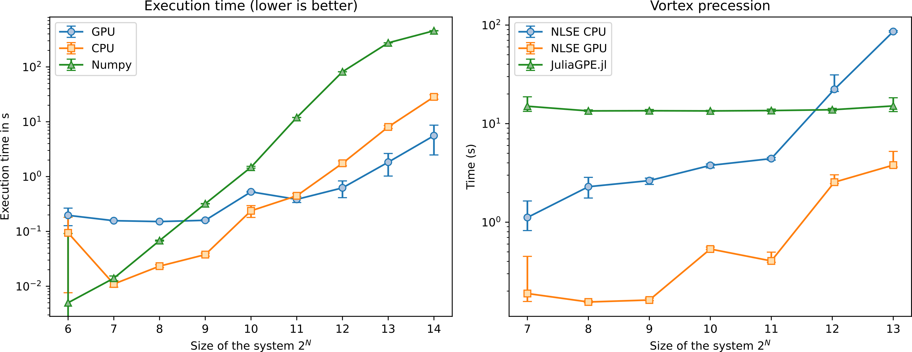

# Summary

The non-linear Schrödinger equation (NLSE) is a general non-linear equation allowing to model the propagation of light in non-linear media.
This equation is mathematically isomorphic to the Gross-Pitaevskii equation (GPE) describing the evolution of cold atomic ensembles.
Providing a flexible, modern and performant framework to solve these equations is a crucial need to model realistic experimental scenarii.

# Statement of need

`NLSE` harnesses the power of pseudo-spectral schemes in order to solve efficiently the following general type of equation:
$$i\partial_t\psi = -\frac{1}{2m}\nabla^2\psi + V\psi + g|\psi|^2\psi.$$

In order to take advantage of the computing power of modern Graphical Processing Units (GPU) for Fast Fourier Transforms (FFT), the main workhorse of this code is the [`cupy`](https://cupy.dev/) package that maps [`numpy`](https://numpy.org/) functionalities onto the GPU using NVIDIA's [`CUDA`](https://developer.nvidia.com/cuda-downloads) API.
It also heavily uses just-in-time compilation using [`numba`](https://numba.pydata.org/) in order to optimize performance while having an easily maintainable Python codebase.
Compared to naive Numpy based CPU implementations, this package provides a 100 to 10000 times speedup for typical sizes \autoref{fig:bench}.
While optimized for the use with GPU, it also provides a performant CPU fallback layer.

The goal of this package is to provide a natural framework for all physicists wishing to model the propagation of light in non-linear media or the temporal evolution of Bose gases. It can also be used to model the propagation of light in general.
It supports lossy, non-linear and non-local media.

It provides several classes to model 1D, 2D propagation, and leverages the array functionalities of `numpy` like broadcasting in order to allow easy scans of physical parameters to most closely replicate experimental setups.

This code has been developped during the author's PhD thesis [@aladjidiFullOpticalControl2023] and used as the main simulation tool for several publications like [@glorieuxHotAtomicVapors2023] and [@bakerrasooliTurbulentDynamicsTwodimensional2023].

# Acknowledgements

We acknowledge contributions from Myrann Baker-Rasooli as our most faithful beta tester.

# Authors contribution

T.A wrote the original code and is the main maintainer, C.P extended the functionalities to include coupled systems. Q.G supervised the project.

# References